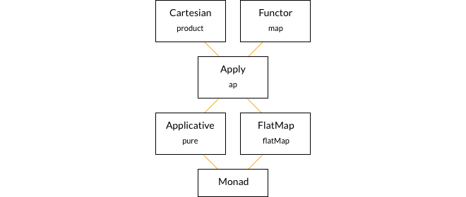

# 6.5 Apply and Applicative

在实际函数式编程中并不怎么提及 `Semigroupal`，因为 `Semigroupal` 仅提供了另一个 type class，即 Applicative Functor 功能的 **子集**。

实际上 `Semigroupal` 和 `Applicative` 是 **同一个概念的不同表达方式**，该概念即 `join context`。

Cats 使用两个 type class 对 applicative 建模：

1. `cats.Apply`
  * `Apply` 继承 `Semigroupal` 和 `Functor`
  * `Apply` 添加 `ap` 函数
    + 类型为 `def ap[A, B](ff: F[A => B])(fa: F[A]): F[B]`
    + 将 `function in context` 应用到 `value in context`
2. `cats.Applicative`
  * `Applicative` 继承 `Apply`，并添加 `pure` 函数

下面是 `Apply` 和 `Applicative` 在 Cats 中的简要定义：

```Scala
trait Apply[F[_]] extends Semigroupal[F] with Functor[F] {
  def ap[A, B](ff: F[A ⇒ B])(fa: F[A]): F[B]

  def product[A, B](fa: F[A], fb: F[B]) =
    ap(map(fa)(a => (b: B) => (a, b)))(fb)
}

trait Applicative[F[_]] extends Apply[F] {
  def pure[A](a: A): F[A]
}
```

`product` 函数是通过 `ap` + `map` 实现的，实际上 `product` `ap` 和 `map` 联系非常紧密，**任意一方都能通过剩余两个函数定义**！

* `Applicative` 特质仅在 `Apply` 上添加了 `pure` 函数
* `Monoid` 特质仅在 `Semigroup` 上添加了 `empty` 函数

并且 `pure` `empty` 概念非常类似！

## 6.5.1 The Hierarchy of Sequencing Type Classes

引入 `Apply` 和 `Applicative` 后，基本覆盖了以不同方式进行 **sequencing computations** 的各个 type class，他们之间关系如下：

{: width="100px" height="100px"}

上图中的每个 type class 都：

1. 代表一种独特的 sequencing semantics
2. 定义辨识度很高的独特方法，并用这些方法实现其父类中的方法

例如：

* `Foo` 是一个 monad，意味着：
  1. 有一个 `Monad[Foo]` 实例
  2. 且该实例实现了 `pure` 和 `flatMap`
  3. 且该实例继承了 `ap` `product` 和 `map` 的标准定义
* `Bar` 是一个 applicative，意味着：
  1. 有一个 `Applicative[Bar]` 实例
  2. 且该实例实现了 `pure` 和 `ap`
  3. 且该实例继承了 `product` 和 `map`

仅凭 `Foo` 是 monad，而 `Bar` 是 applicative，能推测出什么呢？

1. 因为 `Monad` 是 `Applicative` 的子类，所以 `Foo` 具备 `flatMap`，而 `Bar` 没有
2. 因为 `Applicative` 约束更少，所以 `Bar` 可以比 `Foo` 更加灵活

这引出了 **power** 和 **constraint** 的权衡：

1. 对数据类型施加的 **constraints* 越多，则其行为 **更加可预期**（例如 `flatMap`）
2. 但更多约束，也意味着该数据类型能建模的行为 **更少**，即其 power 更弱

而 `Monad` 恰好是一个很好折中点，能力够强，可以对很多行为建模，而约束也足够，从而对其行为有足够保证，当然也有一些 `Monad` 不适合的场景：

* `Monad` 对计算施加 **strict sequencing**，适用于顺序计算
* `Applicative` 没有 **顺序约束**，因此可以用于并行/并发计算，但却丧失了 `flatMap` 这个大杀器