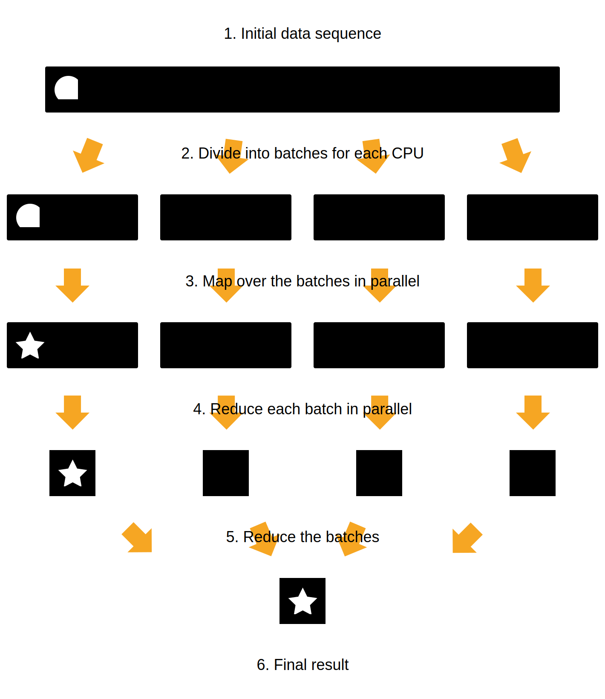

# 9.3 Parallelising foldMap

9.2 节实现了单线程版 `foldMap`，本节以它为基础，实现分布式版 `foldMap`（实际只是个多 CPU 并行版本，并不会真正使用多机集群，但原理类似）。

分布式 `foldMap` 算法如下图：



1. 初始需要处理的所有数据
2. 将初始数据分为多 **批**，每个 CPU 负责处理一个 **批**
3. 每个 CPU 运行本 **批** 数据的 `map`
4. 每个 CPU 运行本 **批** 数据的 `reduce`，并生成本 **批** 数据的结果
5. 将所有 CPU 的结果 `reduce` 为总体结果

Scala 的 [并行集合](http://docs.scala-lang.org/overviews/parallel-collections/overview.html) 可以很容易实现上述算法，但本书使用更底层的 `Future` 来手动实现算法。

## 9.3.1 Futures, Thread Pools, and ExecutionContexts

`Future` 本质就是一个 `Monad`，`Future` 运行在 `ExecutionContext` 指定的 **线程池** 上，因此无论以何种方式创建 `Future`，当前作用域都必须有 `ExecutionContext`：

```Scala
import scala.concurrent.Future
import scala.concurrent.ExecutionContext.Implicits.global

// f1: scala.concurrent.Future[Int] = Future(<not completed>)
val f1 = Future {
  (1 to 100).toList.foldLeft(0)(_ + _)
}

// f2: scala.concurrent.Future[Int] = Future(<not completed>)
val f2 = Future {
  (1 to 100).toList.foldLeft(0)(_ + _)
}
```
* 注意 `f1` 和 `f2` 都未完成
* `ExecutionContext.Implicits.global` 使用的线程池中，线程数量与 CPU 数量相同
* `ExecutionContext` 负责 `Future` 的 **调度执行**

`map` 和 `flatMap` 可以根据其他 `Future` 的结果创建新的 `Future`，此时被 **依赖** 的 `Future` 完成后，如果有空闲线程，则立即执行 `map` `flatMap` 的计算：

```Scala
// f3: scala.concurrent.Future[String] = Future(<not completed>)
val f3 = f1.map(_.toString)

// f4: scala.concurrent.Future[Int] = Future(<not completed>)
val f4 =
  for {
    a ← f1
    b ← f2
  } yield a + b
```

还可以用 `Future.traverse` 或 `Traverse` 将 `List[Future[A]]` 转换为 `Future[List[A]]`：

```Scala
import cats.instances.future._ // for Applicative
import cats.instances.list._   // for Traverse
import cats.syntax.traverse._  // for sequence

// Future[List[Int]] = Future(<not completed>)
Future.sequence(List(Future(1), Future(2), Future(3)))

// Future[List[Int]] = Future(<not completed>)
List(Future(1), Future(2), Future(3)).sequence
```

还可以用 `Await.result` 阻塞线程，获得 `Future` 的结果：

```Scala
import scala.concurrent._
import scala.concurrent.duration._

Await.result(Future(1), 1.second) // wait for the result
// res10: Int = 1
```

最后 Cats 也提供了 `Monad[Future]` 和 `Monoid[Future]` 实例：

```Scala
import cats.{Monad, Monoid}
import cats.instances.int._    // for Monoid
import cats.instances.future._ // for Monad and Monoid

Monad[Future].pure(42)

Monoid[Future[Int]].combine(Future(1), Future(2))
```

## 9.3.2 Dividing Work

可以用 `Runtime.getRuntime.availableProcessors()` 获取可用的 CPU 核心数量，可以用 `grouped` 对序列分组：

```Scala
// List[List[Int]] = List(List(1, 2, 3), List(4, 5))
(1 to 5).toList.grouped(3).toList
```
* 每组 3 个元素，最后的组是剩余元素

## 9.3.3 Implementing parallelFoldMap

实现并行版 `foldMap`：

```Scala
def parallelFoldMap[A, B: Monoid](xs: Vector[A])(f: A ⇒ B): Future[B] = {
  val N = Runtime.getRuntime.availableProcessors()
  val batchSite = (1.0 * xs.size / N).ceil.toInt

  val batches: List[Vector[A]] = xs.grouped(batchSite).toList

  val futures: List[Future[B]] = batches.map(batch ⇒ Future(foldMap(batch)(f)))  // 并行

  Future.sequence(futures) map { bs ⇒
    bs.foldLeft(Monoid[B].empty)(Monoid[B].combine)
  }
}
```

使用 `parallelFoldMap` 求和如下：

```Scala
val sum = parallelFoldMap((1 to 100000).toVector)(identity)

Await.result(sum, 1.second)  // Int = 705082704
```

## 9.3.4 parallelFoldMap with more Cats

前面手动实现了 `parallelFoldMap`，现在使用 Cats 提供的 `Foldable` 和 `Traverse` 重新实现 `parallelFoldMap`:

```Scala
import cats.Monoid
import cats.instances.int._     // Monoid[Int]
import cats.instances.vector._  // Foldable and Traverse
import cats.instances.future._  // Applicative and Monad
import cats.syntax.traverse._  
import cats.syntax.foldable._

import scala.concurrent.{Await, Future}
import scala.concurrent.duration._
import scala.concurrent.ExecutionContext.Implicits.global

def parallelFoldMap[A, B: Monoid](xs: Vector[A])(f: A ⇒ B): Future[B] = {
  val N = Runtime.getRuntime.availableProcessors()
  val batchSite = (1.0 * xs.size / N).ceil.toInt

  val batches: Vector[Vector[A]] = xs.grouped(batchSite).toVector

  batches
    .traverse(batch ⇒ Future(batch.foldMap(f)))
    .map(_.combineAll)
}
```
