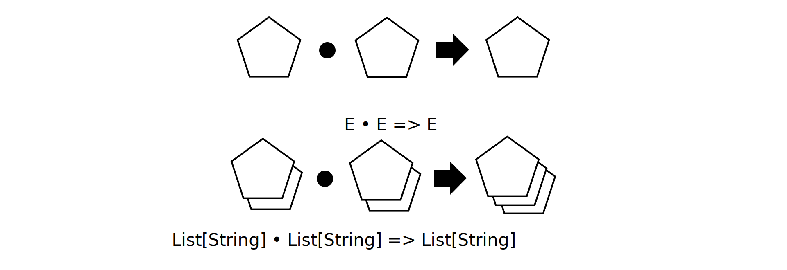

# 10.3 Basic Combinators

首先为 `Check` 添加 `and` 组合子函数。

`and` 组合子接受两个 `Check`，只有两个 `Check` 都成功时，`and` 组合出的 `Check` 才会成功。

```Scala
trait Check[E, A] {
  def apply(value: A): Either[E, A]
  
  def and(that: Check[E, A]): Check[E, A] = ???
}
```

### 组合 `E`

当 `and` 的两个 `Check` **都失败** 时，需要将两者的错误信息 **一起** 返回，但目前没有什么方式能组合 `E` 的值，我们想要的效果如下：



* 对于类型 `E` 的两个值，有函数 `.` 将它们组合为一个 `E`

只要有 `Semigroup[E]` 实例，即可用 `combine` 或 `|+|` 语法来组合 `E` 的值：

```Scala
import cats.{Monoid, Semigroup}
import cats.instances.list._    // Semigroup[List]
import cats.syntax.semigroup._  // |+|

val listSemigroup: Semigroup[List[Int]] = Semigroup[List[Int]]

// List[Int] = List(1, 2, 3, 4, 5, 6)
listSemigroup.combine(List(1, 2, 3), List(4, 5, 6))

// List[Int] = List(1, 2, 3, 4, 5, 6)
List(1, 2, 3) |+| List(4, 5, 6)
```

>**注意**：因为不需要 **单位元**，所以无需用 `Monoid`，只用 `Semigroup` 即可（尽量使用 **更小** 的约束）。

### `and` 是否应该短路

`and` 第一个 check 失败时，是否应该采取短路策略，不再计算第二个 check 了呢？

作为校验系统，我们希望一次检查暴露尽量多错误，应尽量避免 short-circuiting，而 `and` 计算的两个 `Check` 是互相独立的，因此可以将它们一起计算完。

### 实现

### function wrapper 实现方式

首先 check 的是类型为 `A => Either[E, A]` 的函数，可以将该函数用 `CheckF` 类包装起来：

```Scala
import cats.Semigroup
import cats.syntax.either._
import cats.syntax.semigroup._

final case class CheckF[E, A](f: A ⇒ Either[E, A]) {
  def apply(value: A): Either[E, A] = f(value)

  def and(that: CheckF[E, A])(implicit me: Semigroup[E]): CheckF[E, A] =
    CheckF { value ⇒
      (this(value), that(value)) match {
        case (Right(a), Right(_)) ⇒ a.asRight
        case (Right(_), Left(e))  ⇒ e.asLeft
        case (Left(e), Right(_))  ⇒ e.asLeft
        case (Left(e1), Left(e2)) ⇒ (e1 |+| e2).asLeft
      }
    }
}
```

* 当 `and` 处理的两个 `CheckF` 结果均为 `Left` 时，使用 `Semigroup[E].combine` 组合两者的值；

使用如下：

```Scala
import cats.instances.list._  // for Semigroup[List]

val f: Int => Either[List[String], Int] =
  i => if (i > 10) List(s"$i can't be bigger than 10!").asLeft else i.asRight

val g: Int => Either[List[String], Int] =
  i => if (i % 2 == 1) List(s"$i can't be even!").asLeft else i.asRight

val c1 = CheckF(f)
val c2 = CheckF(g)

val c3 = c1 and c2

// Either[List[String],Int] = Right(6)
c3(6)

// Either[List[String],Int] = Left(List(11 can't be bigger than 10!, 11 can't be even!))
c3(11)
```

目前看该实现已满足需求，但若无 `Semigroup[E]` 实例，会怎么样呢，例如 `Nothing` 就没有 `Semigroup` 实例：

```Scala
val a: CheckF[Nothing, Int] = CheckF(v ⇒ v.asRight)
val b: CheckF[Nothing, Int] = CheckF(v ⇒ v.asRight)

a(10)  // Right(10)
b(10)  // Right(10)

val c = a and b  // 报错
```

* `a` 和 `b` 定义、使用并不受影响；
* 当使用 `a and b` 组合两者时会报错，提示无法找到 `Semigroup[Nothing]` 实例；

### Algebraic Data Type 实现方式

可以用 algebraic data type 对 `Check` 进行建模，此时 `and` 的结果为一个 data type：

```Scala
sealed trait Check[E, A] {
  def and(that: Check[E, A]): Check[E, A] = And(this, that)

  def apply(value: A)(implicit s: Semigroup[E]): Either[E, A] =
    this match {
      case Pure(f)          ⇒ f(value)
      case And(left, right) ⇒
        (left(value), right(value)) match {
          case (Right(a), Right(_)) ⇒ a.asRight
          case (Right(_), Left(e))  ⇒ e.asLeft
          case (Left(e), Right(_))  ⇒ e.asLeft
          case (Left(e1), Left(e2)) ⇒ (e1 |+| e2).asLeft
        }
    }
}

final case class And[E, A](left: Check[E, A], right: Check[E, A]) extends Check[E, A]

final case class Pure[E, A](f: A ⇒ Either[E, A]) extends Check[E, A]
```

使用如下：

```Scala
type F[A] = A ⇒ Either[List[String], A]

val f: F[Int] = n ⇒ if (n > 10) List(s"$n can't be bigger than 10!").asLeft else n.asRight
val g: F[Int] = n ⇒ if (n % 2 == 1) List(s"$n can't be even!").asLeft else n.asRight

val c1 = Pure(f)
val c2 = Pure(g)
val c3 = c1 and c2
```
* 若无 `Semigroup[E]` 定义 `c1 and c2` 不再报错，但是调用 `c3(23)` 时依然会报错，不过已经比以前好点了！

### function wrapper vs ADT

ADT 实现明显更啰嗦，但相对 function wrapper 实现，能将 the structure of the computation(the ADT instance we create) 与 the process that gives it meaning (the `apply` method) 分离开（而 function wrapper 实现中，计算过程是 **耦合** 在 `and` 中的），这样做有如下优点

1. inspect and refactor checks after they are created;
2. move the `apply` “interpreter” out into its own module;
3. implement alternative interpreters providing other functionality (for example visualizing checks).

因此我们采用 ADT 实现。

## 用 `Validated` 替换 `Either`

前面用 `Either` 收集错误信息，因为 `Either` 是 fail-fast 的，所以前面没有用 for 解析，而是用模式匹配实现的，`Either` 与我们要实现的 accumulating error-handling 语义不符，使用 `Validated` 替代：

```Scala
import cats.Semigroup
import cats.data.Validated
import cats.syntax.validated._
import cats.syntax.apply._      // mapN

sealed trait Check[E, A] {
  def and(that: Check[E, A]): Check[E, A] = And(this, that)

  def apply(value: A)(implicit s: Semigroup[E]): Validated[E, A] =
    this match {
      case Pure(f)          ⇒ f(value)
      case And(left, right) ⇒ (left(value), right(value)).mapN((_, _) ⇒ value)
    }
}

final case class And[E, A](left: Check[E, A], right: Check[E, A]) extends Check[E, A]

final case class Pure[E, A](f: A ⇒ Validated[E, A]) extends Check[E, A]
```

可以看到 `apply` 的实现更加简洁，使用用 `mapN` 即可。

## 实现 `or`

```Scala
import cats.Semigroup
import cats.data.Validated
import cats.data.Validated.{Invalid, Valid}
import cats.syntax.validated._
import cats.syntax.semigroup._
import cats.syntax.apply._

/**
  * Author: Kyle Song
  * Date:   上午9:16 at 18/3/31
  * Email:  satansk@hotmail.com
  */
sealed trait Check[E, A] {
  def and(that: Check[E, A]): Check[E, A] = And(this, that)

  // 新增
  def or(that: Check[E, A]): Check[E, A] = Or(this, that)

  def apply(value: A)(implicit s: Semigroup[E]): Validated[E, A] =
    this match {
      case Pure(f)          ⇒ f(value)
      case And(left, right) ⇒ (left(value), right(value)).mapN((_, _) ⇒ value)
      // 新增
      case Or(left, right)  ⇒
        left(value) match {
          case Valid(v)   ⇒ v.valid
          case Invalid(x) ⇒
            right(value) match {
              case Valid(v)   ⇒ v.valid
              case Invalid(y) ⇒ (x |+| y).invalid
            }
        }
    }
}

final case class And[E, A](left: Check[E, A], right: Check[E, A]) extends Check[E, A]
// 新增
final case class Or[E, A](left: Check[E, A], right: Check[E, A]) extends Check[E, A]

final case class Pure[E, A](f: A ⇒ Validated[E, A]) extends Check[E, A]
```

添加 `or` 需要在 `apply` 中添加对 `Or` 的解析计算！

使用如下：

```Scala
import cats.instances.list._

type F[A] = A ⇒ Validated[List[String], A]

val f: F[Int] = n ⇒ if (n > 10) List(s"$n can't be bigger than 10!").invalid else n.valid
val g: F[Int] = n ⇒ if (n % 2 == 1) List(s"$n can't be even!").invalid else n.valid

val c1 = Pure(f)
val c2 = Pure(g)

val c1Orc2 = c1 or c2

c1Orc2(22)  // Right(22)
```