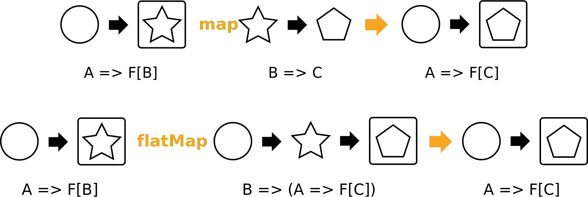

# 10.1 Sketching the Library Structure

上手写代码之前，先捋一捋前面的设计目标。

## Providing error messages

失败时附加有用的错误信息，则 check 的结果有两种情况：

1. 返回被校验的值本身
2. 返回错误提示信息

check 的结果可以用 a value in a context 来抽象，该 context 为 `the context is the possibility of an error message`：

* check 的求值结果为 a value in context

而 check 本身则是将 value 转化为 value in a context 的函数：

* check 本身为函数 `A => F[A]`

## Combine checks

如何将 smaller checks 组成为 bigger checks 呢，这种组合是否可以用 `Semigroupal` 或者 `Applicative` 表示呢：

答案是否定的，在 `Applicative` 风格的组合中，被组合的两个 check 将被应用到 **同一个值** 上，造成最后的 `tuple` 中是两个相同的结果！

实际上，`Monoid` 风格的组合更适合，但需要定义一个 **identity check** 和两个用于组合的 binary combinator：`and` 和 `or`：

因为 `and` `or` 的实际使用频率非常接近，如果将它们分别定义为 **两个** `Monoid`，则需要在这两个 `Monoid` 之间不断切换，因此不把它们定义成 `Monoid`，而是定义为函数。

## Accumulating errors as we check

`Monoid` 也很适合 accumulating errors，可以将错误信息存储在 `List` 或 `NonEmptyList` 中，这样就可以使用 Cats 中预定义好的 `Monoid[List]` 实例来收集错误信息了。

## Transforming data as we check it

除 check 数据外，还需 transform 数据，`map` 和 `flatMap` 似乎很适合转换数据，则貌似需要将 check 定义为 `Monad`：

 

 * 注意：`A => F[A]` 是 check 的类型！
